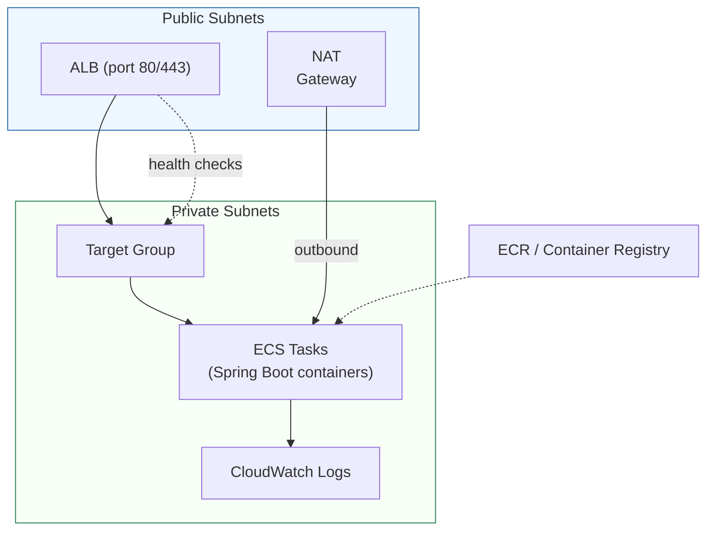
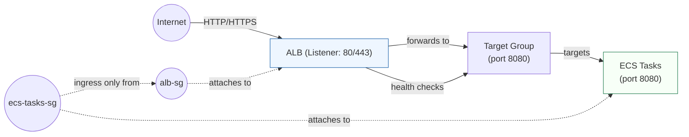

# Deployment of Spring Boot WebSocket on ECS

This IaC configuration deploys the Spring Boot WebSocket application to AWS ECS with an Application Load Balancer (ALB).

## Architecture Overview

- **VPC**: Custom VPC with public and private subnets across multiple availability zones
- **ECS Cluster**: Fargate-based ECS cluster with Container Insights enabled
- **ECS Service**: Manages containerized Spring Boot application with auto-scaling
- **Application Load Balancer**: Exposes the application on port 80 (or 443 with SSL)
- **Auto-scaling**: CPU and memory-based scaling policies
- **Logging**: CloudWatch log group for application logs

## Architecture Diagram




## Prerequisites

1. **Terraform** >= 1.0
2. **AWS CLI** configured with appropriate credentials
3. **Docker image** pushed to ECR (Elastic Container Registry)
4. **AWS Account** with appropriate permissions

## Setup Instructions

### 1. Build and Push Docker Image to ECR

```bash
# establish aws credentials for CLI
aws login

# Get your AWS Account ID
ACCOUNT_ID=$(aws sts get-caller-identity --query Account --output text)
AWS_REGION="us-east-1"

# Create ECR repository
aws ecr create-repository \
  --repository-name spring-boot-websocket \
  --region $AWS_REGION

# can use either docker or podmain
OCI_tool=docker|podmain
# Build the Docker image
cd build/libs
$OCI_tool build -t spring-boot-websocket:latest -f ../resources/main/docker/Dockerfile .
cd ../..

# Login to ECR
aws ecr get-login-password --region $AWS_REGION | \
  $OCI_tool login --username AWS --password-stdin \
  $ACCOUNT_ID.dkr.ecr.$AWS_REGION.amazonaws.com

# Tag the image
$OCI_tool tag spring-boot-websocket:latest \
  $ACCOUNT_ID.dkr.ecr.$AWS_REGION.amazonaws.com/spring-boot-websocket:latest

# Push to ECR
$OCI_tool push $ACCOUNT_ID.dkr.ecr.$AWS_REGION.amazonaws.com/spring-boot-websocket:latest
```

### 2. Configure $TF_tool Variables

Copy the example file and update with your values:

```bash
cp terraform.tfvars.example terraform.tfvars
```

Edit `terraform.tfvars` and update:
- `ecr_repository_url`: Your ECR image URL
- Other variables as needed

### 3. Initialize Terraform

```bash
# chose between $TF_tool or tofu
TF_tool=terraform|tofu

$TF_tool init
```

### 4. Review and Apply Configuration

```bash
```markdown
# $TF_tool Configuration for Spring Boot WebSocket on ECS

This $TF_tool configuration deploys the Spring Boot WebSocket application to AWS ECS with an Application Load Balancer (ALB).


## Prerequisites

1. **Terraform** >= 1.0
2. **AWS CLI** configured with appropriate credentials
3. **Docker image** pushed to ECR (Elastic Container Registry) or accessible container registry
4. **AWS Account** with appropriate permissions

## Setup Instructions

### 1. Build and Push Docker Image to ECR (example)

```bash
# Get your AWS Account ID
ACCOUNT_ID=$(aws sts get-caller-identity --query Account --output text)
AWS_REGION="us-east-1"

# Create ECR repository (if needed)
aws ecr create-repository \
  --repository-name spring-boot-websocket \
  --region $AWS_REGION || true

# Build the Docker image
docker build -t spring-boot-websocket:latest .

# Login to ECR
aws ecr get-login-password --region $AWS_REGION | \
  docker login --username AWS --password-stdin \
  $ACCOUNT_ID.dkr.ecr.$AWS_REGION.amazonaws.com

# Tag the image
docker tag spring-boot-websocket:latest \
  $ACCOUNT_ID.dkr.ecr.$AWS_REGION.amazonaws.com/spring-boot-websocket:latest

# Push to ECR
docker push $ACCOUNT_ID.dkr.ecr.$AWS_REGION.amazonaws.com/spring-boot-websocket:latest
```

### 2. Configure $TF_tool Variables

Edit `terraform.tfvars` and update:
- `ecr_repository_url`: Your container image URL
- Other variables as needed

### 3. Initialize Terraform

```bash
$TF_tool init
```

### 4. Review and Apply Configuration

```bash
# configure aws credentials for $TF_tool with IAM user key (AWS console > IAM > <youruser> > Security tab)
export AWS_ACCESS_KEY_ID="***"
export AWS_SECRET_ACCESS_KEY="***"
export AWS_DEFAULT_REGION=us-east-1

# Review the planned changes
$TF_tool plan

# Apply the configuration
$TF_tool apply
```

### 5. Access the Application

Once deployed, the application will be accessible via the ALB DNS name:

```bash
$TF_tool output application_url
```

## SSL/TLS

To enable HTTPS:

1. Create or import a certificate in AWS Certificate Manager, get its ARN
2. Update `terraform.tfvars`:
   ```
   enable_ssl = true
   ssl_certificate_arn = "arn:aws:acm:region:${account}:certificate/${id}"
   alb_port = 443  # Change to 443 for HTTPS
   ```

## Important Notes

### Port Configuration

- The Spring Boot application runs on port **8080** inside the container
- The ALB listener is exposed on port **80** (HTTP) by default
- The ALB forwards traffic to the target group on port 8080
- The container port is configurable via `container_port` variable

#### Network / Port Diagram




## Useful Commands

```bash
# View outputs
$TF_tool output

# Get specific output
$TF_tool output alb_dns_name

# View logs
aws logs tail /ecs/spring-boot-websocket --follow

# View running tasks
aws ecs list-tasks --cluster spring-boot-websocket-cluster

# View task details
aws ecs describe-tasks --cluster spring-boot-websocket-cluster \
  --tasks <task-arn>

# Stop and restart ECS service
$TF_tool apply -var="desired_count=0"  # stop
$TF_tool apply -var="desired_count=2"  # start

# Clean up all resources
$TF_tool destroy
```

## Troubleshooting

### Tasks failing to start

Check CloudWatch logs:
```bash
aws logs tail /ecs/spring-boot-websocket --follow
```

### ALB not routing traffic

Check target group health:
```bash
aws elbv2 describe-target-health --target-group-arn <target-group-arn>
```

## Cost Optimization

1. **Reduce task count**: Set `desired_count = 1` for development
2. **Use smaller resources**: Reduce `container_cpu` and `container_memory`
3. **Adjust auto-scaling**: Increase `min_capacity` threshold for less frequent scaling
4. **Use NAT Gateway selectively**: Only needed if tasks require outbound internet

## Cleanup

Remove all AWS resources:

```bash
$TF_tool destroy
```

## IAM Roles

| Role name | Purpose | Principal | Typical permissions / notes |
|---|---|---:|---|
| `ecs_task_execution_role` | Allows ECS tasks to pull images and write logs | `ecs-tasks.amazonaws.com` | `ecr:GetAuthorizationToken`, `ecr:BatchGetImage`, `ecr:GetDownloadUrlForLayer`, `logs:CreateLogStream`, `logs:PutLogEvents`, `secretsmanager:GetSecretValue` (optional) |
| `ecs_task_role` | Role assumed by application code running in the task | `ecs-tasks.amazonaws.com` | Application-specific permissions only (e.g., `ssm:GetParameter`, `secretsmanager:GetSecretValue`, S3 access) — keep least privilege |
| `ecs_service_autoscaling_role` (optional) | Allows Application Auto Scaling to scale the ECS service | `application-autoscaling.amazonaws.com` | `autoscaling:*` / `cloudwatch:DescribeAlarms` as required by autoscaling policies |


## Security Groups

| Security Group | Ingress | Egress | Attached to |
|---|---|---|---|
| `alb-sg` | HTTP 80 / HTTPS 443 from 0.0.0.0/0 (or narrower CIDRs) | All outbound (0.0.0.0/0) | Application Load Balancer |
| `ecs-tasks-sg` | Application port (default 8080) **only** from `alb-sg` | All outbound (0.0.0.0/0) or restricted per VPC egress rules | ECS tasks (ENIs) |
| `db-sg` (if used) | DB port (e.g., 5432) only from `ecs-tasks-sg` or other app SGs | All outbound (or restricted) | RDS / database instances |
```

